# Stock Trend Research Workflow Architecture

This document describes the implemented research-only architecture, execution
boundaries, model identities, persisted contracts, and fail-closed behavior.
The normative product boundary and roadmap remain in
[`stock-trend-research-workflow-plan-v3_0.md`](stock-trend-research-workflow-plan-v3_0.md).

Current implementation versions:

- package: `0.3.0`;
- workflow: `3.1.0`;
- strategy: `2.1.0`;
- analyst and research-signal contracts: `2.0.0`;
- email-delivery request contract: `2.0.0`;
- prompt bundle: `v2`.

## Product and trust boundary

The repository produces evidence-linked stock-trend research. It has no
transaction, position-sizing, portfolio-account, broker, or market-action
component. Model outputs cannot cause a financial action.

The main trust boundaries are:

1. external evidence enters only through read-only deterministic adapters;
2. external content is treated as untrusted data, never instructions;
3. a producer model interprets minimized point-in-time evidence;
4. a different-vendor validator reviews every research signal;
5. deterministic code owns policy, schemas, validation merging, rendering,
   state, publication, and delivery requests;
6. publication and email delivery are explicit, idempotent side effects.

## Detailed workflow

```mermaid
flowchart TB
    subgraph DATA["A. Read-only data boundary"]
        EXT["External evidence<br/>Market · SEC · EIA · bounded social"]
        ADAPTER["Read-only deterministic adapters<br/>External content is untrusted data"]
        SNAPSHOT["Immutable source snapshot<br/>timestamps · provenance · hashes · coverage"]
        GATE{"Freshness and coverage gate"}
        BLOCKED["Block production research<br/>stale or invalid source state"]
        DEGRADED["Continue as degraded research<br/>incomplete coverage remains visible"]

        EXT --> ADAPTER --> SNAPSHOT --> GATE
        GATE -->|"Stale or invalid"| BLOCKED
        GATE -->|"Fresh, incomplete"| DEGRADED
    end

    subgraph CONTROL["B. Deterministic Python control plane"]
        CONFIG["Versioned configuration<br/>workflow · strategy · sources · tiers · universe"]
        IDENTITY["Logical run identity<br/>venue · session date · window · strategy version"]
        STORE["RunStore<br/>lease · atomic writes · hashes · transition trace"]
        FACTS["Point-in-time normalization<br/>facts_block with lineage"]
        SCREEN["Deterministic screening<br/>price · liquidity · momentum · relative volume"]
        COVERAGE["Industry and source coverage report"]

        CONFIG --> IDENTITY --> STORE
        GATE -->|"Fresh, complete"| FACTS
        DEGRADED --> FACTS
        FACTS --> SCREEN --> COVERAGE
    end

    subgraph PRODUCER["C. Producer model boundary — one vendor client"]
        CONTEXT["Task: market_context<br/>cycle stage · direction bias · limitations"]
        CANDIDATES["Screened candidates<br/>bounded by industry and total caps"]
        ANALYST["Task: stock_analyst<br/>one isolated call per candidate"]
        ANALYST_OUT["analyst_output v2<br/>claims · strength · thesis · 5D/1M/3M outlooks"]
        SYNTH["Task: synthesizer<br/>consolidate analyst evidence"]
        SIGNAL["research_signal v2<br/>research_only = true"]

        FACTS --> CONTEXT
        SCREEN --> CANDIDATES --> ANALYST
        FACTS --> ANALYST
        CONTEXT --> ANALYST
        ANALYST --> ANALYST_OUT --> SYNTH
        CONTEXT --> SYNTH
        SYNTH --> SIGNAL
    end

    subgraph VALIDATION["D. Independent fail-closed validation boundary"]
        DET["Deterministic checks<br/>policy · horizons · claims · facts · same instrument"]
        PACKET["Minimized evidence packet<br/>signal + cited claims + selected facts"]
        SEMANTIC["Task: semantic_validator<br/>different model vendor required"]
        CONSISTENCY["Verdict consistency checks<br/>exact claim coverage · target identity"]
        MERGE{"Deterministic result merge"}
        PASS["Pass<br/>eligible for ranked research sections"]
        NONPASS["Reject · indeterminate · unavailable<br/>excluded from rankings"]

        SIGNAL --> DET
        SIGNAL --> PACKET
        FACTS --> PACKET
        PACKET --> SEMANTIC --> CONSISTENCY
        DET --> MERGE
        CONSISTENCY --> MERGE
        MERGE -->|"Both pass"| PASS
        MERGE -->|"Any failure"| NONPASS
    end

    subgraph RENDER["E. Deterministic rendering and publication"]
        DIGEST["Markdown evidence digest"]
        HTML["HTML research briefing<br/>top five · downside warnings · 5D/1M/3M"]
        ESCAPE["HTML escaping and artifact QA<br/>no scripts or unfilled slots"]
        LOGS["Sanitized HTML system logs<br/>JSON attachment"]
        FINAL["Finalized immutable manifest"]
        COMMIT["Idempotent artifact committer"]
        ARTIFACTS["Committed research artifacts"]
        OUTBOX["Durable email requests<br/>blocked → pending"]
        HOST["Authenticated mail connector<br/>acknowledge only after confirmed send"]

        PASS --> DIGEST
        PASS --> HTML
        NONPASS --> HTML
        COVERAGE --> HTML
        HTML --> ESCAPE
        STORE --> LOGS
        DIGEST --> FINAL
        ESCAPE --> FINAL
        LOGS --> FINAL
        FINAL --> COMMIT --> ARTIFACTS
        COMMIT --> OUTBOX --> HOST
    end

    subgraph EVALUATION["F. Independent outcome evaluation"]
        OBS["Future point-in-time observations<br/>configured horizons"]
        OUTCOME["Outcome v2<br/>return · excess return · direction · missing-data reason"]

        SIGNAL -.-> OBS --> OUTCOME
    end

    subgraph REGEN["G. Generation-only path"]
        STORED["Stored committed analysis<br/>context · validated signals · coverage"]
        EMAIL_RENDERER["Deterministic HTML renderer<br/>zero model calls"]
        PREVIEW["Standalone preview<br/>manifest and outbox unchanged"]

        ARTIFACTS -.-> STORED --> EMAIL_RENDERER --> PREVIEW
    end
```



## Execution sequence and state

The analysis state machine is:

```text
created → ingesting → normalized → screened → analyzed → validated
        → rendered → emails_generated → finalized → committed
```

Any nonterminal state may transition to `failed`. Publication and email
activation occur only after deterministic rendering and validation artifacts
exist. Email requests are created as `blocked`, become `pending` only after the
manifest reaches `committed`, and become `acknowledged` only after the host mail
connector confirms delivery.

The logical run key includes:

```text
workflow_version
strategy_id
strategy_version
venue
exchange_session_date
analysis_window
```

A run revision identifies an intentional rerun when code, prompt, policy,
schema, or provider dependency hashes change.

## Model tasks and identities

The workflow uses bounded model tasks, not autonomous subagents.

| Task | Client | Input boundary | Output |
|---|---|---|---|
| `market_context` | producer | point-in-time facts block | `cycle_context` |
| `stock_analyst` | producer | one candidate, its facts, context, strategy | `analyst_output` |
| `synthesizer` | producer | analyst outputs, context, venue map | `research_signal[]` |
| `semantic_validator` | different-vendor validator | signal, cited claims, minimized evidence | semantic verdict |

The per-symbol analyst loop is currently sequential. An `analyst_output_id` or
`research_signal_id` is an artifact identity, not a process, account, Codex
thread, or subagent identity.

### Offline demonstration identities

The offline demonstration uses deterministic local handlers:

| Responsibility | Vendor label | Model identity | Network call |
|---|---|---|---|
| producer | `openai` | `scripted-producer` | no |
| validator | `anthropic` | `scripted-validator` | no |

These labels exercise routing and vendor-separation controls. They do not prove
a real OpenAI or Anthropic provider integration.

### Production host routing

| Host | Producer | Independent validator |
|---|---|---|
| Codex | saved ChatGPT/Codex subscription through `codex exec` | Anthropic Messages API |
| Claude | saved Claude subscription through `claude --print` | OpenAI Responses API |

Relevant model configuration:

- `STOCKTREND_CODEX_MODEL`: optional Codex subscription model override; without
  it the manifest records `codex-subscription-default`;
- `STOCKTREND_CLAUDE_CODE_MODEL`: Claude subscription producer override;
- `STOCKTREND_OPENAI_MODEL`: OpenAI API validator model;
- `STOCKTREND_ANTHROPIC_MODEL`: Anthropic API validator model.

Producer subprocesses remove API-key variables belonging to the producer
vendor. Models receive no repository, delivery, Git, browser-session, broker,
or secret-management tools.

## Subagent identity

The implemented workflow creates no Codex, Claude, or other autonomous
subagents. All four model tasks run through two explicit clients owned by the
single deterministic orchestrator:

- one producer client;
- one different-vendor validator client.

Parallel or delegated subagent identity is therefore intentionally absent.
This prevents hidden tool inheritance, untracked delegation, and ambiguous
responsibility for model output. If bounded concurrency is added later, each
call must retain stable task, candidate, prompt, producer, and artifact
identities while preserving deterministic output order.

## Research signal and outlooks

Every `research_signal` contains:

- strategy and instrument identity;
- `research_only: true`;
- positive, negative, watch, or no-action assessment;
- a 1-to-10 uncalibrated signal-strength score;
- thesis, monitoring triggers, evidence claims, and known gaps;
- 5-session short, 21-session medium, and 63-session cycle outlooks;
- producer and source-analysis lineage;
- independent validation status and reason codes.

Outlook values use the basis `model_estimate_uncalibrated`. They are not
historical win rates, expected returns, profit guarantees, personalized advice,
or transaction instructions. Each outlook cites claims, and those claims must
resolve to same-instrument point-in-time facts.

## Ranked email behavior

The HTML research briefing contains:

- up to five independently validated `positive_trend` opportunities;
- independently validated `negative_trend` downside warnings;
- signal strength, confidence, thesis or warning triggers;
- 5-session, 21-session, and 63-session outlooks;
- coverage, degraded-state, validation, and research-only disclosures.

Rejected, indeterminate, unavailable, and pending signals are excluded from
ranked sections. Model-originated strings are HTML-escaped, active content is
prohibited, and the Markdown digest remains attached for evidence review.

## Fail-closed cases

The affected signal cannot pass when any of the following occurs:

- producer and validator vendor IDs match;
- validator timeout, quota exhaustion, exception, or malformed output;
- target identity mismatch;
- supported and unsupported claim sets overlap or do not exactly cover the
  signal evidence claims;
- unsupported claims or reason codes remain on a passing verdict;
- strategy, assessment, research horizon, or outlook horizon mismatch;
- unknown, duplicate, future, or cross-instrument evidence;
- missing required fact types;
- `research_only` is not exactly `true`.

Validator unavailability and vendor mismatch are recorded as degraded run
reasons. They never trigger same-vendor fallback.

## Persisted boundaries

| Location | Purpose | Git policy |
|---|---|---|
| `spec/` | workflow, strategy, source, tier, evaluation, and universe policy | tracked |
| `schemas/` | versioned JSON Schema contracts | tracked |
| `prompts/` | bounded prompt bundles | tracked |
| `stocktrend/` | deterministic engine and provider adapters | tracked |
| `templates/` | deterministic Markdown templates | tracked |
| `tests/` | contract, safety, workflow, and failure tests | tracked |
| `state/` | manifests, checkpoints, locks, previews, and delivery outbox | ignored |
| `artifacts/` | committed generated research artifacts | ignored |

Credentials, raw provider prompts, raw provider responses, browser sessions,
cookies, page HTML, screenshots, and licensed raw data must not be committed.

## Implementation map

- orchestration: [`stocktrend/workflow.py`](stocktrend/workflow.py);
- provider clients and routing: [`stocktrend/providers.py`](stocktrend/providers.py);
- deterministic and semantic validation: [`stocktrend/validation.py`](stocktrend/validation.py);
- state and transitions: [`stocktrend/state.py`](stocktrend/state.py);
- source orchestration: [`stocktrend/sourcing.py`](stocktrend/sourcing.py);
- digest rendering: [`stocktrend/rendering.py`](stocktrend/rendering.py);
- HTML email rendering: [`stocktrend/email_rendering.py`](stocktrend/email_rendering.py);
- durable email requests: [`stocktrend/notifications.py`](stocktrend/notifications.py);
- artifact publication: [`stocktrend/committer.py`](stocktrend/committer.py);
- evaluation: [`stocktrend/evaluation.py`](stocktrend/evaluation.py).

## Verification boundary

The repository completion checks are:

```bash
.venv/bin/python -m pytest
.venv/bin/stocktrend demo
git diff --check
```

The offline demo validates deterministic orchestration only. A real provider
integration may be claimed only after valid credentials and successful network
responses from the configured producer and independent validator.
